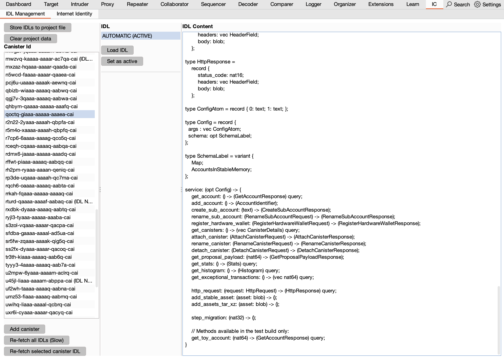

# ic-burp-extension

A burp plugin that makes pentesting of [ICP](https://internetcomputer.org) dapps a breeze.

---

### Table of Contents
- [Features](#features)
- [System Requirements](#system-requirements)
- [Quickstart](#quickstart)

## Features
#### Decode requests and responses

#### Send modified requests with your [internet identity](https://identity.ic0.app)

#### Manage multiple internet identities

#### Manage canister interfaces with automatic discovery & manual import

## System Requirements
The following platforms are currently supported:
- macOS (Apple Silicon)
- macOS (Intel) :test_tube:
- Linux (x64) :test_tube:
- Windows (x64) :test_tube:

## Quickstart

### Installation
1. Download the JAR from the latest [release](https://github.com/dfinity/ic-burp-extension/releases). There is only a single JAR that works with all operating systems specified under [System Requirements](#system-requirements).
2. Open Burp, click on the `Extensions` tab and the `Installed` subtab. In the `Burp extensions` section, click the `Add` button and select the downloaded JAR. If installation was successful, the extension should be shown in the extension list and a new `IC` tab should appear:

### Viewing decoded requests and responses
1. Open the `Proxy` tab and the `HTTP history` subtab.
2. If the history is empty click on the `Open browser` button.
3. In the browser open [NNS Dapp](https://nns.ic0.app).
4. In Burp make sure that binary content is not filtered, by clicking on `Filter settings` and enabling `Other binary`:

5. Click on an ICP request that contains encoded CBOR content. In the request/response section you should find a `IC Request`/`IC Response` tab if the extension has correctly identified the request/response. Clicking on this tab shows the decoded content:

### Managing canister interfaces
In order to be able to encode and decode ICP messages to/from canisters, the extension needs to know the canister interface of the recipient canister. Some canisters expose their canister interface while others don't. The interfaces can be managed by clicking on the `IC` tab and the `IDL Management` subtab:

The UI is split into three parts from left to right:

**Project data management and canister selection.** With the buttons at the top, the canister interface data can be written into or removed from the project file which was selected when Burp was started. All data that is not written into a project file is lost when Burp is closed.

Below the project data management buttons is a list of all canisters for which interface information is available or where interactions were detected. The buttons at the bottom allow to add additional canisters to that list or automatically try to fetch canister interface information for all/single canister(s).

**IDL selection.** In the middle section information about the interfaces for the canister selected in the left section are shown. Clicking on an interface reveals its content in the right section. If the canister exposes an interface the entry `AUTOMATIC` will be present. The `Load IDL` button allows to load an interface from a file which can be helpful if no interface is exposed or the exposed interface is not accurate. To change the interface which the extension uses during en/decoding, select an entry and press the `Set as active` button.

**IDL content view.** The rightmost section shows the contents of the IDL that was selected in the middle section.

### Managing Internet Identities
The extension supports sending ICP messages from the repeater and intruder tool (see section TODO). Non-anonymous messages need to be signed. For this internet identities (II) can be used. In order to sign messages with an II a passkey must be generated and registered with the II. For this a UI is provided under the `IC` tab and the `Internet Identity` subtab:

The `Add` button guides through the process of adding a passkey to an existing II. Once the process is completed the anchor is permanently stored in the extension storage and is available for use in all Burp projects. It is highly recommended to create separate II(s) for testing with Burp, because if the passkey leaks, the II can be compromised.

The `Remove` button deletes the passkey of the selected II from the extension storage. Note that this does not remove the passkey from the II. This must be done in the [II Dapp](https://identity.ic0.app).

The `Refresh IIs` button checks for all IIs if the passkey that the extension has stored is still registered. If not it changes the state to `Deactivated`. To enable it again the `Reactivate selected II` button can be used which tries to add a new passkey to the selected II.

The `Get delegation` button generates a delegated identity for the selected II under the provided hostname. This is useful if the same identity should be used in scripts for fully automated testing. Rust sample code that shows how to create an identity from the generated string can be found [here](https://gist.github.com/tmu0/3c31a7064e9a5d9d326a473025727a49).

### Sending requests from Intruder or Repeater
It is possible to modify captured requests and send them again. The extension will make sure that the metadata fields are properly updated and - if desired - the request is correctly signed. Currently signing is only supported for Internet Identities which need to be [registered first](#managing-internet-identities).
The process works as follows:
1. Capture some requests in the `HTTP history` as described [here](#viewing-decoded-requests-and-responses).

2. Right-click on a request that should be resent and select `Extensions -> IC Burp Extension -> Send to intruder/repeater`

3. Open the tool to which the request was sent (Repeater in the example)

The headers in line 17-19 were added by the extension. `X-Ic-Decoded` is just a marker that is used to decide if a message needs to be encoded before sending (no need to change this). `X-Ic-Sign-Identity` and `X-Ic-Frontend-Hostname` control the signing behavior: In the example the principal that is derived from the II anchor `2143428` under hostname `https://nns.ic0.app` is used, i.e., the principal that this II anchor has in the NNS Dapp. The extension has selected these values because the original request was also signed by this principal. They can be changed before the request is sent, however it must be ensured that a passkey was registered for the used II anchor (see [II management](#managing-internet-identities)). If the request should not be signed, i.e., the sender should be the anonymous principal, the value `anonymous` can be used for `X-Ic-Sign-Identity`. Note that all three headers are removed before the message is sent to the IC.

4. (Optional) Adjust the signing headers.
5. (Optional) Adjust the message. In the example the `rename_sub_account` method of the NNS canister is called, which renames the NNS Dapp wallet of the user to the name `My Wallet` in the original request. We will inject the `<h1>` HTML tag into the wallet name to test if this gets rendered by the NNS Dapp frontend.
6. Hit the send button and wait for the reply. In the case of a `call` request, the extension will automatically call `read_state` until the reply is available and provide the decoded candid response as the response body in Burp:
